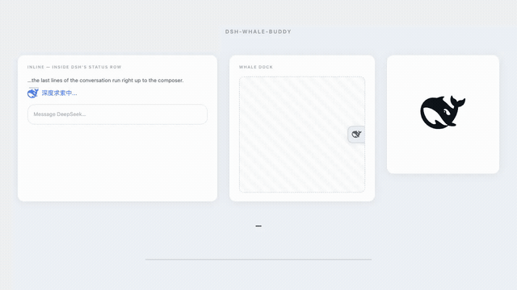

<h1 align="center">🐋 dsh-whale-buddy</h1>

<p align="center">
  <strong>基于弹簧物理引擎与状态感知的灵动鲸鱼伴侣，专为 DeepSeek Harness Web 打造。</strong>
</p>

<p align="center">
  <a href="README.md"></a>
  <a href="README_CN.md"></a>
</p>

<p align="center">
  
  
  
  
</p>

---

> [!NOTE]
> **独立社区开源项目**：`dsh-whale-buddy` 是一个独立的第三方开源插件，并非 DeepSeek 官方产品，与 DeepSeek 之间不存在任何隶属、赞助或背书关系。鲸鱼矢量图形商标权归 DeepSeek 所有，详见 [THIRD_PARTY_NOTICES.md](THIRD_PARTY_NOTICES.md)。

---

## 🌟 项目简介

`dsh-whale-buddy` 为 DeepSeek Harness Web (DSH) 带来了一只生动、细腻且富有生命力的交互伴侣，实时映射模型的思考、工具调用与生成状态。

核心动画基于弹簧物理引擎驱动：当对话开始时，鲸鱼从波浪中破水跃出，平稳巡游于状态文本旁，并根据当前任务佩戴专属矢量道具——同时严格保留 DeepSeek 官方矢量标志的原始几何结构与纯粹质感。

<p align="center">
  
</p>

---

## ✨ 核心特点

- 🌊 **拟真跃动破水动效**  
  每轮对话开始时破水跃出，激起涟漪水花与水面下潜动作，为模型交互带来仪式感与生动反馈。

- 🐋 **活灵活现的呼吸式伴随**  
  不仅是静态 Logo，鲸鱼在空闲与执行时会自然呼吸、随机眨眼，并根据行进速度灵动微转航向，久伴不腻。

- 🎯 **全周期任务与状态感知**  
  实时感知思考、作答、工具调用、文件读写、上下文压缩与等待确认，搭配清晰直观的状态文案与专属生动道具。

- 🧷 **双重优雅交互形态**  
  - **行内状态鲸鱼**：紧密伴随在对话输入栏的状态文本旁，不遮挡、不抖动、零布局位移；  
  - **侧边交互伴随坞 (Whale Dock)**：吸附于视口右缘的微型交互胶囊，支持纵向自由拖拽，点击平滑展开为控制与预览面板。

- 🎨 **浑然天成的原生质感**  
  自动采样原生界面的字体渐变色阶，完美自适应深浅主题；100% 保持官方标志的纯正矢量结构，不破坏任何原有视觉比例。

- ♿ **完备的无障碍体验**  
  完全遵循系统级“减少动态效果”（`prefers-reduced-motion`），静止状态依旧优雅，面板无延迟展开，无后台资源空耗。

---

## 🖥️ 双交互形态

### 1. 行内状态鲸鱼 (Inline Status Whale)

每当对话轮次启动，行内鲸鱼完成优雅的破水跃出，随后平稳巡游在状态文本左侧。它将原本笼统的标签替换为明确直观的当前任务描述（`深度求索中…`、`正在作答…`、`读取文件中…`、`执行命令中…` 等），并头顶相应道具。

- **视觉零抖动**：采用负边距计算，跃水弧线的空间溢出完全在视觉外层展开，对话框与文字布局全程稳如磐石。
- **色彩自然契合**：自动读取原生界面的渐变停靠点颜色，明暗两套主题均能与文字排版天然浑成。
- **兼容两种 DSH 状态标签**：
  - **DSH 0.1.7** 取消了蓝色的“深度求索中...”行，运行状态改由回合顶部的灰色折叠标题承载（“深度求索中，用时12秒”）。鲸鱼随之进入该标题并沿用其灰色；只替换前面的文字（`读取文件中，用时12秒`），DSH 自带的计时照常走动。
  - **DSH 0.1.5** 仍绘制蓝色行，鲸鱼照旧嵌入其中。
- **经典状态栏开关**（Dock 面板 → *经典状态栏*，默认关闭）：在 DSH 0.1.7 上，于输入框正上方重新绘制旧版蓝色状态行——相同字号、相同渐变流光、运行 15 秒后显示计时——鲸鱼位于文字左侧，DSH 的灰色折叠标题保持原样。与默认方式不同，这一行会占用版面：每轮出现、消失各一次，与 DSH 0.1.5 自带的那一行一致。中英文界面都固定显示 **Deep diving...**，鲸鱼动画仍跟随当前任务。在 DSH 0.1.5 上直接使用原生行并固定其文字，不会重复绘制。

### 2. 鲸鱼侧边交互坞 (Whale Dock)

持久贴合在窗口右缘的微型伴随入口，随时掌握系统动向。悬浮按钮、展开预览与 session 内的鲸鱼共用任务状态和切换时机。

- **轨道纵向拖拽**：可按住按钮沿边缘自由上下滑动，或聚焦后使用 `方向键` / `Home` / `End` 精确调整；位置以相对比例存储，窗口缩放自适应。
- **连续曲面展开**：点击后沿边缘平滑向内展开轻量伴随控制面板，内置大尺寸动态预览、实时状态监视与核心设置项。
- **便捷退出**：支持通过关闭按钮、`Escape` 键或点击外部区域迅速收起。

---

## 🎭 状态与动作矩阵

| 状态 | 状态文案 | 专属道具 | 动态姿态与行为 |
| :--- | :--- | :--- | :--- |
| `idle` | — | 玩耍顶球（静止 9 秒后触发） | 从容巡游，长驻留，偶发舒缓微动作 |
| `thinking` | 深度求索中… | 律动三点动画 | 专注前倾，快速响应弹簧，鼻尖略微向下 |
| `responding` | 正在作答… | 呼吸对话气泡 | 稳定向前漂移 |
| `working` | 执行命令中… | 旋转扳手 | 干练敏捷，节奏明朗 |
| `working · reading` | 读取文件中… | 腹部流动文件流 | 文件自右向左平滑穿梭掠过 |
| `working · editing` | 编辑文件中… | 书写铅笔 | 短促快速笔触，伴随缓慢位移 |
| `working · searching`| 搜索中… | 巡视放大镜 | 灵动环视扫描 |
| `compacting` | 压缩上下文中… | 无（形体动作） | 竖向弹性挤压与过冲回弹 |
| `waiting` | 等待你的确认… | 倾斜问号 | 头部微昂，静候交互 |
| `error` | 出错了 | 醒目红色感叹号 | 紧凑抖动，以鲜明红调第一时间提示异常 |

> [!TIP]
> 所有道具均为在官方标志外轮廓绘制的独立单色矢量图形，确保 DeepSeek 官方图形资产 100% 纯净与原汁原味。

---

## 📦 安装与接入

`dsh-whale-buddy` 遵循标准 DeepSeek Harness Web 插件规范。

### 1. 声明至 Web Profile

将插件依赖加入您的 DSH 个人 Web 配置：

```jsonc
// ~/.dsh/profiles/web/package.json
{
  "dependencies": {
    "dsh-whale-buddy": "^0.2.1"
  },
  "dsh": {
    "profile": {
      "bundles": [
        "@deepseek-ai/dsh-base",
        "@deepseek-ai/dsh-web-app",
        "dsh-whale-buddy"
      ]
    }
  }
}
```

### 2. 安装插件

```bash
cd ~/.dsh/profiles/web
npm install dsh-whale-buddy@0.2.1
```

**环境要求：** DeepSeek Harness `0.1.5-rc.2` 至 `0.1.7-rc.1`（需具备 `shell.overlay` 与 `conversation.input.overlay` 插槽；经典状态行另需 `conversation.input.dock`）。

---

## ⚙️ 个性化配置

侧边面板保留实时状态和三个设置：对话鲸鱼、经典状态栏、动效。面板跟随 DSH 的深浅主题；关闭对话鲸鱼时，经典状态栏选项暂不可用，原有选择会保留。

其他配置可通过 `localStorage` 调整：

| `localStorage` 键 | 候选值 | 默认值 | 说明 |
| :--- | :--- | :--- | :--- |
| `dsh-whale-buddy.enabled` | `1` / `0` | `1` | 全局总开关 |
| `dsh-whale-buddy.inlineEnabled` | `1` / `0` | `1` | 启用 / 禁用行内状态鲸鱼 |
| `dsh-whale-buddy.classicStatus` | `1` / `0` | `0` | 在输入框上方恢复蓝色 Deep diving... 行，文字固定，鲸鱼跟随任务 |
| `dsh-whale-buddy.dockEnabled` | `1` / `0` | `1` | 启用 / 禁用侧边 Whale Dock |
| `dsh-whale-buddy.size` | `18` – `36` | `26` | 行内鲸鱼尺寸 (px) |
| `dsh-whale-buddy.motion` | `full` / `subtle` / `static` | `full` | 动效强度档位 |
| `dsh-whale-buddy.dockTop` | `0.0` – `1.0` | `0.5` | 侧边坞纵向轨道归一化位置 |

---

## 🔬 技术实现与底层细节

### 1. 物理仿真引擎
- **120 Hz 定步长弹簧积分**：使用定步长子步进结合临界阻尼算法求解运动方程，保证在不同屏幕刷新率下运动节奏绝对一致，杜绝突发掉帧造成的姿态跳变。
- **33 节点流体波浪模型**：通过 33 个相互耦合的离散弹簧阵列实时计算水面高度与动量传递，逼真再现穿过水面时的凹陷、回弹与双向扩散波纹。
- **亚像素级尺度换算**：所有物理位移与振幅均基于目标 CSS 像素直接换算，而非依赖相对矢量单位，确保在高分屏缩放下的细腻锐利。

### 2. 无损 DOM 注入与零回流机制
- **引用身份追踪（Reference Identity Tracking）**：通过 `role="status"` 定位后直接绑定 DOM 元素对象引用，彻底规避因文字变化引起的循环二次匹配。在 DSH 0.1.7 上，`role="status"` 元素是一个视觉隐藏的播报节点；锚点顺着它找到紧随其后的 `[data-turn-process]` 标题，且从不改写播报节点本身。
- **负边距视觉出血 (`fitToMark()`)**：将跃水动画所需的垂直空间转换为外部溢出渲染，元素在文档流中保持严格恒定的 26 px 尺寸，杜绝会话重排。
- **纯净生命周期**：卸载或会话切换时，即刻断开所有 MutationObserver 并注销动画循环，完整复原原生 DOM 节点。

### 3. 响应式状态流与调度防抖
- **精准快照驱动**：直接解构 DSH 的底层响应式快照（Snapshot），提取流式状态、工具调用队列与交互阻塞信号。
- **700 ms 防抖窗口**：对任务状态施加最短展示阈值，避免底层毫秒级临时工具调用在界面上产生视觉频闪。
- **锁存错误脉冲化**：通过比对错误字段的“变更事件”而非单一静态值，避免历史历史遗留异常导致常驻错误指示。

### 4. 零外部依赖与纯矢量保真
- 运行时代码无任何外部依赖，核心逻辑与 UI 框架彻底解耦。
- DeepSeek 官方矢量路径作为刚体置于 SVG 亮度蒙版中，全程保持 0 坐标变形。

---

## 🏗️ 目录结构与架构

```
src/
├── index.ts                     # 插件主入口
├── client/
│   ├── index.ts                 # DSH 插槽注册
│   ├── config.ts                # 严格类型校验的配置模块
│   ├── locales.ts               # 双语国际化文本定义
│   ├── integration/
│   │   ├── dsh.ts               # 插槽 React 桥接
│   │   ├── thinking-state.ts    # 语义状态评估器
│   │   └── status-anchor.ts     # 安全无损的状态行 DOM 注入器
│   ├── state/
│   │   └── whale-state.ts       # 响应式状态管理 Store
│   ├── whale/                   # 独立物理与动作解算内核
│   │   ├── geometry.ts          # 官方 DeepSeek 矢量路径
│   │   ├── types.ts             # 动力学与姿态类型定义
│   │   ├── spring.ts            # 定步长弹簧积分器
│   │   ├── leap.ts              # 跃水解析弧线模型
│   │   ├── water.ts             # 33 节点耦合流体波浪模型
│   │   ├── props.ts             # 道具状态机与调度器
│   │   ├── renderer-svg.ts      # 硬件加速 SVG 渲染器
│   │   └── view.ts              # RAF 生命周期调度管理
│   └── surfaces/
│       ├── inline-status.ts     # 行内状态界面控制器
│       ├── whale-dock.ts        # 侧边坞触发器控制器
│       ├── dock-panel.ts        # 展开伴随面板控制器
│       └── dock-drag.ts         # 物理拖拽控制器
└── styles/
    └── plugin-css.ts            # 样式表与 CSS 变量封装
```

---

## 🛠️ 本地开发与测试

项目配备完备的自动化测试体系，在无头环境中验证物理收敛性、DOM 安全性与产物健全度：

```bash
# TypeScript 静态类型检查
npm run typecheck

# 构建生产产物
npm run build

# 运行全量测试套件（针对生产 bundle 运行 138 项测试）
npm run verify

# 启动本地可视化交互演示环境
npm run demo        # 访问 http://localhost:4173/demo/index.html

# 自动化生成视觉资产与动画录像
npm run shots       # 无头生成截图
npm run film        # 录制完整动效展示视频
```

---

## 🧩 兼容性与降级设计

- **基准验证版本**：`@deepseek-ai/dsh@0.1.5-rc.1`（客户端包 `0.1.5-rc.2`，已在运行中的应用里实测）；客户端包 `0.1.7-rc.1`（类型检查通过，DOM 结构取自已发布的 `ui-chat` / `ui-conversation` 产物，尚未在运行中的 0.1.7 应用里实测）。
- **DSH 0.1.7 信号变化**：`useSessionPendingInteraction` 已移除（等待态改读 `useSessionStatus`）；会话列表不再给出当前会话，Dock 改由会话级插槽条目驱动。两者都按宿主自动选择，0.1.5 仍可正常使用。
- **平稳降级保证**：若未来 DSH 调整底层插槽命名或重构状态行，插件将安静跳过挂载，绝不影响正常的对话使用。
- **色彩自适应**：优先跟随界面 `--dsw-alias-*` 主题变量，同时内置多套高对比度备用配色方案。

---

## 🙏 致谢

- **架构沿革**：感谢 [dsh-thought-buddy](https://github.com/dsh-plugins/dsh-thought-buddy) (BSD-3-Clause) 提供的模块加载隔离理念、定步长弹簧时间模型以及产物测试方案。
- **交互灵感**：感谢 [dsh-notch](https://github.com/aa2246740/dsh-notch) (MIT) 带来的边缘吸附连续曲面交互设计思想。
- **经典状态行样式**：独立重现了 DSH 0.1.5 运行中标签的样式（`@deepseek-ai/dsh-client-ui-chat`，MIT，© DeepSeek），使用 DSH 自身的设计变量。
- **图形版权**：标志图形归 DeepSeek 官方所有，提取自 [deepseek-harness](https://github.com/deepseek-ai/deepseek-harness)（`FishLogo.tsx`），未作任何矢量坐标篡改。

---

## 📄 开源协议

[BSD-3-Clause](LICENSE) © 2026 dsh-whale-buddy contributors.
